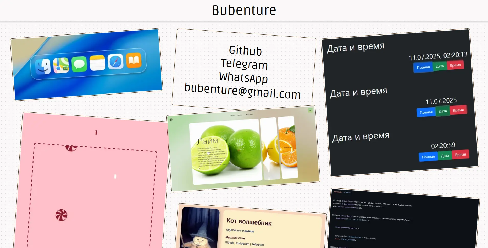
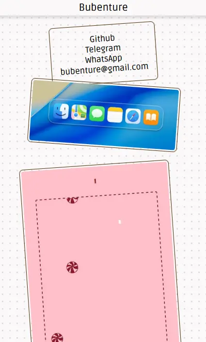
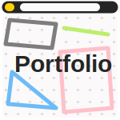

 # https://bubenture.github.io/gallery

Одностраничный адаптивный сайт-портфолио. Сайт реализован на чистом HTML, CSS и JavaScript без сторонних библиотек. Галерея проектов автоматически подстраивается под размер экрана, а контакты доступны как в галерее, так и в футере.
- Адаптивная галерея: На мобильных устройствах проекты отображаются одной колонкой, на десктопе — в три слайдера.
- Ленивая загрузка изображений: Используется атрибут `loading="lazy"` для оптимизации скорости загрузки.

  
  
  

